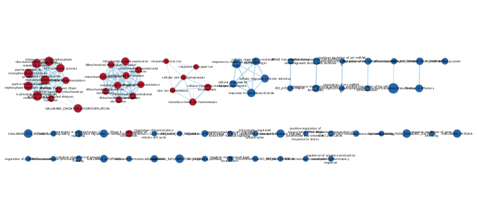

```{r setup, include=FALSE}
knitr::opts_chunk$set(echo = TRUE)
```

``` {r, message=FALSE, warning=FALSE}

```

## Dataset Introduction

In A1, I cleaned and normalized the dataset with the GEO ascension GSE75011, a dataset called Transcriptional profiling of TH2 cells identifies pathogenic features associated with asthma that was associated with the publication "Transcriptional Profiling of Th2 Cells Identifies Pathogenic Features Associated with Asthma" (Seumois et al. 2016). 

In A2, I took the dataset that was cleaned in A1 and calculated and ranked differential gene expression. Thresholded overexpression analysis was performed to differentiate which genes were the most predominantly expressed genes were identified.


## Load Libraries
``` {r, message=FALSE, warning=FALSE}
if (!requireNamespace("BiocManager", quietly = TRUE))
    install.packages("BiocManager")

if (!requireNamespace("ggplot2", quietly = TRUE))
    install.packages("ggplot2")

if (!requireNamespace("RCy3", quietly = TRUE))
    install.packages("RCy3")

if (!requireNamespace("readr", quietly = TRUE))
    install.packages("readr")

library("BiocManager")
library("ggplot2")
library("RCy3")
library("dplyr")
library("readr")

```


## Non-thresholded Gene Set Enrichment Analysis 

``` {r}

# formatting data for export

AR_to_all <- read.csv("out_AR_to_all.csv")
AR_output <- dplyr::select(AR_to_all, gene_hgnc, rank)
AR_output <- as_tibble(AR_output)
# write.table(AR_output, "./projects/ARvsall_ranked_list.rnk", row.names = FALSE, quote = FALSE, sep="\t")

AS_to_all <- read.csv("out_AS_to_all.csv")
AS_output <- dplyr::select(AS_to_all, gene_hgnc, rank)
AS_output <- as_tibble(AS_output)
# write.table(AS_output, "./ASvsall_ranked_list.rnk", row.names = FALSE, quote = FALSE, sep="\t")
            

```

After running GSEA, here are some of the results.

```{r}

gsea_na_pos_AR_to_all <- read_tsv("gsea_report_for_na_pos_AR_to_all.tsv")
gsea_na_pos_AS_to_all <- read_tsv("gsea_report_for_na_pos_AS_to_all.tsv")

knitr::kable(head(gsea_na_pos_AR_to_all))
knitr::kable(head(gsea_na_pos_AS_to_all))


```

**What method did you use? What genesets did you use? Make sure to specify versions and cite your methods.** 

I used the GSEA like we covered in our homework assignment. IN addition I also used the Human_GOBP_AllPathways_no_GO_iea_March_01_2021_symbol.gmt data set from the Bader lab. 

**Summarize your enrichment results.**
In the AS to all comparison ranked list, the top five annotations were associated with ion homeostasis and mitochondrial translation initiation. 
I find the ion homeostasis factor rather interest, as I faintly recall regulations of some charged ions being important in the production of mucus 
in the lungs while a symptom of asthma includes over production of mucus. 

I also looked into the AR to all comparison even though not too many genes were significant or passed correction. The top five annotations revolved 
around functions in the central dogma, that being protein folding and mRNA transport. 

**How do these results compare to the results from the thresholded analysis in Assignment #2. Compare qualitatively. Is this a straight forward comparison? Why or why not?**

For the AS comparison in the tresholded analysis, the whole list results were very generally described as "regulation of primary metabolic process" whereas for the non-thresholded gene set analysis there is a lot more granularity with the annotations. This may be a semantic quirk based on how 
specific the databases are, but nonetheless, it's not exactly a one to one comparison. As similar observation is made with the AR comparison as well.


## Visualize your Gene set Enrichment Analysis in Cytoscape

When I ran Enrichment Map, I got a warning about the genes not being ranked from greatest to least, so I ordered them as such in order to avoid errors. 

```{r}
AS_output <- AS_output[order(AS_output$rank, decreasing=TRUE ),]
AS_output <- as_tibble(AS_output)
# write.table(AS_output, "./ASvsall_ranked_list_highest_to_lowest.rnk", row.names = FALSE, quote = FALSE, sep="\t")
```


Create an enrichment map - how many nodes and how many edges in the resulting map? What thresholds were used to create this map? Make sure to record all thresholds. Include a screenshot of your network prior to manual layout.

There are 76 nodes and 122 edges in this map under a moderately conservation threshold of p-value < 0.005 and FDR < 0.075.



Annotate your network - what parameters did you use to annotate the network. If you are using the default parameters make sure to list them as well.

Make a publication ready figure - include this figure with proper legends in your notebook.

Collapse your network to a theme network. What are the major themes present in this analysis? Do they fit with the model? Are there any novel pathways or themes?

## Interpretation and detailed view of results


he most important aspect of the analysis is relating your results back to the initial data and question.

Do the enrichment results support conclusions or mechanism discussed in the original paper? How do these results differ from the results you got from Assignment #2 thresholded methods
Can you find evidence, i.e. publications, to support some of the results that you see. How does this evidence support your result?
Using your networks and results from the previous section add one of the following:

Add a post analysis to your main network using specific transcription factors, microRNAs or drugs. Include the reason why you chose the specific miRs, TFs or drugs (i.e publications indicating that they might be related to your model). What does this post analysis show?
Choose a specific pathway or theme to investigate in more detail. Why did you choose this pathway or theme? Show the pathway or theme as a gene network or as a pathway diagram. Annotate the network or pathway with your original log fold expression values and p-values to show how it is effected in your model. (Hint: if the theme or pathway is not from database that has detailed mechanistic information like Reactome you can use apps like GeneMANIA or String to build the the interaction network.)
Sometimes the most interesting information is the gene that has no information. In this type of pathway analysis we can only discover what we have already described previously in the literature or pathway databases. Often pathways found in one disease are applicable to other diseases so this technique can be very helpful. It is important to highlight any genes that are significantly differentially expressed in your model but are not annotated to any pathways. We refer to this set of genes as the dark matter.
Include a heatmap of any significant genes that are not annotated to any of the pathways returned in the enrichment analysis.
Include a heatmap of any significant genes that are not annotated to any pathways in entire set of pathways used for the analysis.


## References
