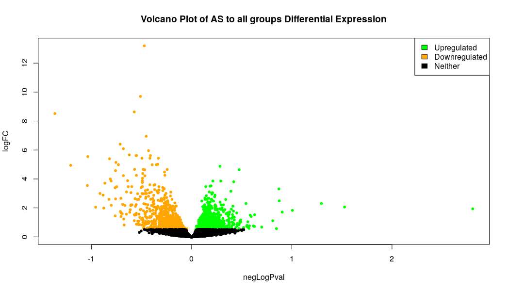
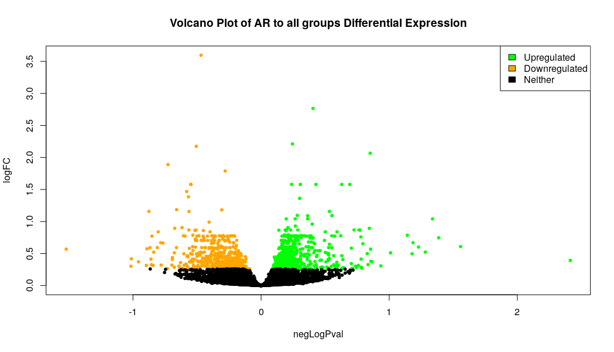
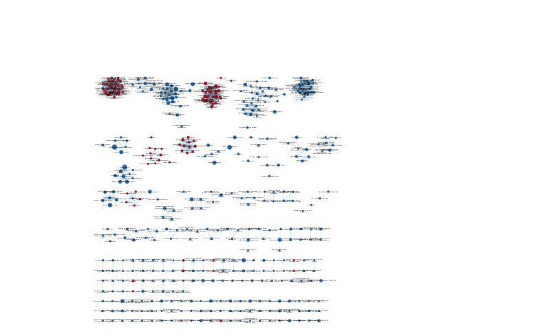
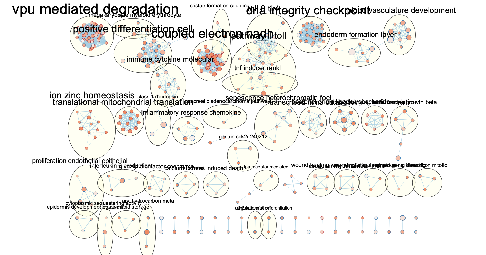
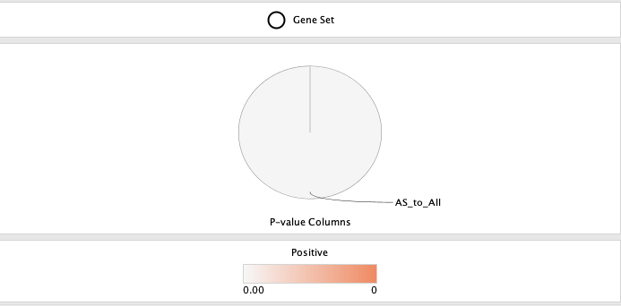
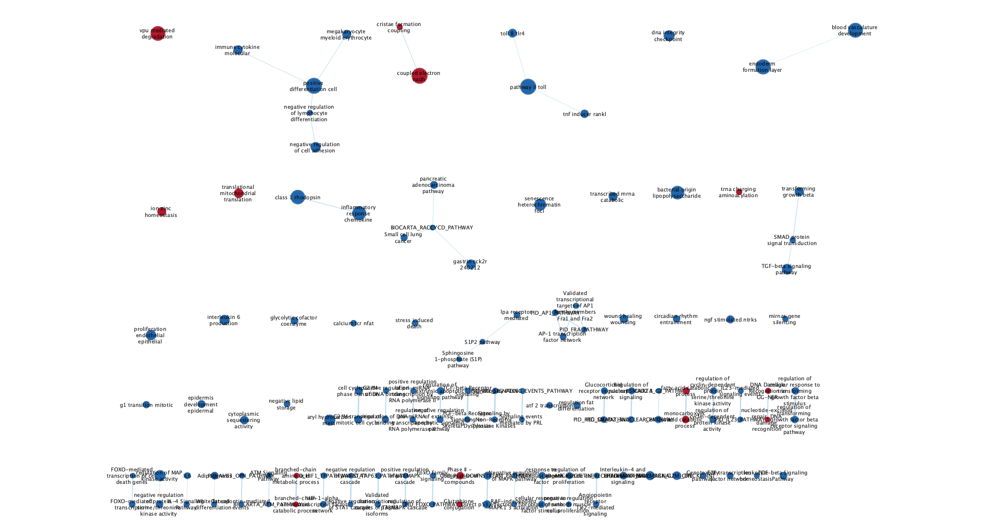
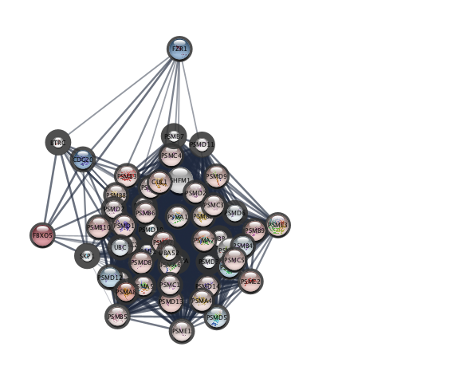

```{r setup, include=FALSE}
knitr::opts_chunk$set(echo = TRUE)
```

## Dataset Introduction

In A1, I cleaned and normalized the dataset with the GEO ascension GSE75011, a dataset called Transcriptional profiling of TH2 cells identifies pathogenic features associated with asthma that was associated with the publication "Transcriptional Profiling of Th2 Cells Identifies Pathogenic Features Associated with Asthma" (Seumois et al. 2016). The edgeR protocol was followed.

In A2, I took the dataset that was cleaned in A1 and calculated and ranked differential gene expression. Thresholded overexpression analysis was performed to differentiate which genes were the most predominantly expressed genes were identified. I observed the differential gene expression of two groups: Allergic Rhinitis (AR) to all groups and Asthma (AS) to all groups.






## Load Libraries
``` {r, message=FALSE, warning=FALSE}
if (!requireNamespace("BiocManager", quietly = TRUE))
    install.packages("BiocManager")

if (!requireNamespace("dplyr", quietly = TRUE))
    install.packages("dplyr")

if (!requireNamespace("readr", quietly = TRUE))
    install.packages("readr")

library("BiocManager")
library("dplyr")
library("readr")

```


## Non-thresholded Gene Set Enrichment Analysis 

``` {r, message=FALSE, warning=FALSE}

# formatting data for export
AR_to_all <- read.csv("out_AR_to_all.csv")
AR_output <- dplyr::select(AR_to_all, gene_hgnc, rank)
AR_output <- as_tibble(AR_output)
# write.table(AR_output, "./projects/ARvsall_ranked_list.rnk", row.names = FALSE, quote = FALSE, sep="\t")

AS_to_all <- read.csv("out_AS_to_all.csv")
AS_output <- dplyr::select(AS_to_all, gene_hgnc, rank)
AS_output <- as_tibble(AS_output)
# write.table(AS_output, "./ASvsall_ranked_list.rnk", row.names = FALSE, quote = FALSE, sep="\t")
            

```

After running GSEA, here are some of the results. Here, I show case some of the na pos results for the two groups.

```{r, message=FALSE, warning=FALSE}
gsea_na_pos_AS_to_all <- readr::read_tsv("gsea_report_for_na_pos_AS_to_all.tsv")
gsea_na_pos_AR_to_all <- readr::read_tsv("gsea_report_for_na_pos_AR_to_all.tsv")

knitr::kable(head(gsea_na_pos_AS_to_all))
knitr::kable(head(gsea_na_pos_AR_to_all))


```

**What method did you use? What genesets did you use? Make sure to specify versions and cite your methods.** 

I used the GSEA like we covered in our homework assignment. IN addition I also used the Human_GOBP_AllPathways_no_GO_iea_March_01_2021_symbol.gmt data set from the Bader lab. 

**Summarize your enrichment results.**
In the AS to all comparison ranked list, the top five annotations were associated with ion homeostasis and mitochondrial translation initiation. 
I find the ion homeostasis factor rather interesting, as I faintly recall regulations of some charged ions being important in the production of mucus 
in the lungs while a symptom of asthma includes over production of mucus. 

I also looked into the AR to all comparison even though not too many genes were significant or passed correction. The top five annotations revolved 
around functions in the central dogma, that being protein folding and mRNA transport. 

**How do these results compare to the results from the thresholded analysis in Assignment #2. Compare qualitatively. Is this a straight forward comparison? Why or why not?**

For the AS comparison in the tresholded analysis, the whole list results were very generally described as "regulation of primary metabolic process" whereas for the non-thresholded gene set analysis there is a lot more granularity with the annotations. This may be a semantic quirk based on how 
specific the databases are, but nonetheless, it's not exactly a one to one comparison. As similar observation is made with the AR comparison as well.


## Visualize your Gene set Enrichment Analysis in Cytoscape

When I ran Enrichment Map, I got a warning about the genes not being ranked from greatest to least, so I ordered them as such in order to avoid errors. 

```{r, message=FALSE, warning=FALSE}
AS_output <- AS_output[order(AS_output$rank, decreasing=TRUE ),]
AS_output <- as_tibble(AS_output)
# write.table(AS_output, "./ASvsall_ranked_list_highest_to_lowest.rnk", row.names = FALSE, quote = FALSE, sep="\t")
```


Given that the original paper had results that highlighted the differences of ashmatic subjects to the rest of the groups, I have decided to pursue 
enrichment analysis of the AS to all group for the rest of this report.

**Create an enrichment map - how many nodes and how many edges in the resulting map? What thresholds were used to create this map? Make sure to record all thresholds. Include a screenshot of your network prior to manual layout.**

There are 457 nodes and 2076 edges in this map under a moderately conserved threshold of p-value < 0.005 and FDR < 0.075. 




**Annotate your network - what parameters did you use to annotate the network. If you are using the default parameters make sure to list them as well.**

I used the AutoAnnotate app to cluster nodes together by a pathway. I used the default MCL Cluster algorithm with the label column GS_DESCR and 40 for the max number of annotations in order to make the image a bit more readable.


Make a publication ready figure - include this figure with proper legends in your notebook.







**Collapse your network to a theme network. What are the major themes present in this analysis? Do they fit with the model? Are there any novel pathways or themes?**




Innate immune response associated themes and other immune system related themes were present in this analysis which is to be expected in the analysis of an asthma related gene set. There was quite a large and dense node labeled "vpu mediated degradation" which is a novel theme in comparison to our previous analysis.


## Interpretation and detailed view of results

**Do the enrichment results support conclusions or mechanism discussed in the original paper? How do these results differ from the results you got from Assignment #2 thresholded methods**

The original paper identified transcripts encoding zinc channel proteins to be upregulated in asthmatic patients. In our network, an "ion zinc homeostasis" pathway is shown to be both upregulated and statistically signficant, congruent with the observations of the original paper. In addition, the original paper had also identified that transcripts relating to MAPK signaling to be downregulated in patients with asthma. A node donated as "regulation of MAP kinase activity" is shown to be downregulated in our enrichment results which is also congruent to the original paper. Interestingly, a pathway associated with fatty acid catabolic processes was upregulated in our enrichment map. The paper briefly touched upon the upregulation of an acyl-CoA dehydrogenase encoder in asthmatic patients and that this is involved in the metabolism of fatty acids. In A2, there was an upregulation of a pathway related to "cellular catabolic process" that may be related to the pathway associated with fatty acid catabolic processes. The results of A2 also did not hightlight any particular processes related to ion zinc homeostasis in comparison to the enrichment map.


**Can you find evidence, i.e. publications, to support some of the results that you see. How does this evidence support your result?**

I was especially curious about the "vpu mediated degradation" pathway in the enrichment map. I found a paper by Roffel et. al (2021) that sought to identify microRNAs (miRNAs) that were associated with asthma. Among the miRNAs they identified, higher expression miR-223-3p was found to be associated inflammatory responses and the organization of cillium in asthmatic patients. Curiously, this miRNA was associated with a negative correlation with Vpu mediated degradation of CD4 Homo sapiens. At the same time in Croteau-Chonka et al. (2018), Vpu mediated degradation of CD4 Homo sapiens was found to be signficantly enriched in obsese asthma patients. 


**Choose a specific pathway or theme to investigate in more detail. Why did you choose this pathway or theme? Show the pathway or theme as a gene network or as a pathway diagram. Annotate the network or pathway with your original log fold expression values and p-values to show how it is affected in your model.**

I chose the vpu mediated degradation pathway to look into in more detail due to there being some loose associations with this pathway with asthmatic patients in previous studies. Node colour correlates with logFC with blue being more negative and red being more positive. Meanwhile, border colour correlates with Pvalue with a slimmer border denoting a smaller Pvalue.




## References

Croteau-Chonka, D. C., Chen, Z., Barnes, K. C., Barraza-Villarreal, A., Celedón, J. C., Gauderman, W. J., Gilliland, F. D., Krishnan, J. A., Liu, A. H., London, S. J., Martinez, F. D., Millstein, J., Naureckas, E. T., Nicolae, D. L., White, S. R., Ober, C., Weiss, S. T., & Raby, B. A. (2018). Gene Coexpression Networks in Whole Blood Implicate Multiple Interrelated Molecular Pathways in Obesity in People with Asthma. Obesity (Silver Spring, Md.), 26(12), 1938–1948. https://doi.org/10.1002/oby.22341

Doncheva, N. T., Morris, J. H., Gorodkin, J., & Jensen, L. J. (2019). Cytoscape StringApp: Network Analysis and Visualization of Proteomics Data. Journal of proteome research, 18(2), 623–632. https://doi.org/10.1021/acs.jproteome.8b00702

Isserlin, R. (2023). Lecture 10 - Recap and GSA. Quercus.
https://q.utoronto.ca/courses/294979/files/24035557?module_item_id=4287874&fd_cookie_set=1

Isserlin, R. (2023). Lecture 11 -Enrichment Map and other Cytoscape Appsother Cytoscape Apps. Quercus. https://q.utoronto.ca/courses/294979/files/24035526?module_item_id=4287888

Isserlin, R. (2023). Lecture 12 -Enrichment Map and other Cytoscape Appsother Cytoscape Apps. Quercus. https://q.utoronto.ca/courses/294979/files/24035559?module_item_id=4287901

Merico, D., Isserlin, R., Stueker, O., Emili, A., & Bader, G. D. (2010). Enrichment map: a network-based method for gene-set enrichment visualization and interpretation. PloS one, 5(11), e13984. https://doi.org/10.1371/journal.pone.0013984

Robinson, M. D., McCarthy, D. J., & Smyth, G. K. (2010). edgeR: a Bioconductor package for differential expression analysis of digital gene expression data. Bioinformatics (Oxford, England), 26(1), 139–140. https://doi.org/10.1093/bioinformatics/btp616

Roffel, M. P., Boudewijn, I. M., van Nijnatten, J. L. L., Faiz, A., Vermeulen, C. J., van Oosterhout, A. J., Affleck, K., Timens, W., Bracke, K. R., Maes, T., Heijink, I. H., Brandsma, C. A., & van den Berge, M. (2022). Identification of asthma-associated microRNAs in bronchial biopsies. The European respiratory journal, 59(3), 2101294. https://doi.org/10.1183/13993003.01294-2021

Seumois, G., Zapardiel-Gonzalo, J., White, B., Singh, D., Schulten, V., Dillon, M., Hinz, D., Broide, D. H., Sette, A., Peters, B., & Vijayanand, P. (2016). Transcriptional Profiling of Th2 Cells Identifies Pathogenic Features Associated with Asthma. Journal of immunology (Baltimore, Md. : 1950), 197(2), 655–664. https://doi.org/10.4049/jimmunol.1600397

Subramanian, A., Tamayo, P., Mootha, V. K., Mukherjee, S., Ebert, B. L., Gillette, M. A., Paulovich, A., Pomeroy, S. L., Golub, T. R., Lander, E. S., & Mesirov, J. P. (2005). Gene set enrichment analysis: a knowledge-based approach for interpreting genome-wide expression profiles. Proceedings of the National Academy of Sciences of the United States of America, 102(43), 15545–15550. https://doi.org/10.1073/pnas.0506580102

Wickham, H. and Francois, R. (2015) dplyr: A Grammar of Data Manipulation. R Package Version 0.4.3.
http://CRAN.R-project.org/package=dplyr

Wickham H, Hester J, Bryan J (2023). readr: Read Rectangular Text Data. https://readr.tidyverse.org, https://github.com/tidyverse/readr.
